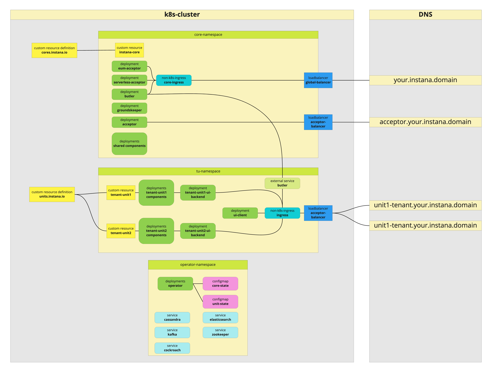
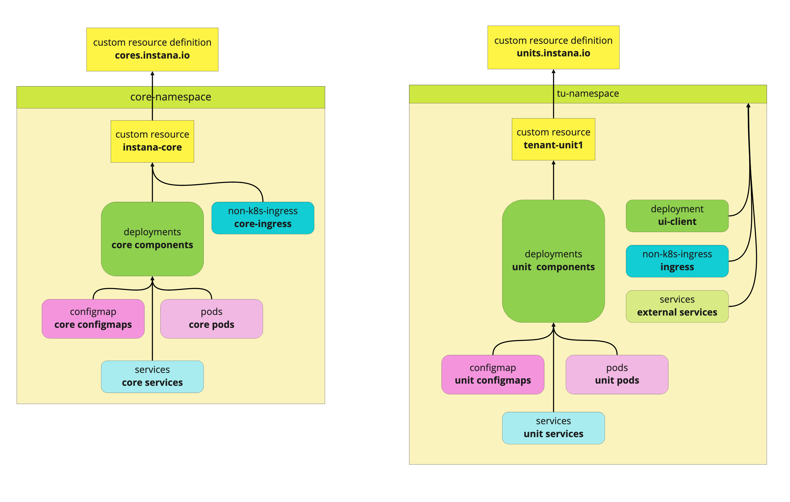

# The Operator

**This is the documentation for the instana-operator-preview.**

There is already a purely [Docker](https://www.docker.com/) based [Self-Hosted Instana](https://www.instana.com/docs/self_hosted_instana).
This version doesn't rely on additional cluster technology and only requires a, rather beefy, machine to run on.

This type of installation works for most of our customers and require the least amount of operations to keep running and up to date.
Some customers have to go way beyond these limits to monitor their infrastructure which requires a lot more scalability on our side which a single box can only provide vertically and only to a limit.

With our recent move to [kubernetes](https://kubernetes.io) we finally had the chance to provide Self-Hosted-Instana to a new group of customers.

Our experiences with kubernetes made it pretty clear that a [k8s-operator](https://operatorframework.io/) would be the way to go to handle a highly distributed system like Instana.

## Requirements
To get started with the operator you will need:
- a working kubernetes cluster
- databases to be set up

## Getting started
The following steps are necessary, to set up a complete Instana operator setup. All necessary objects are defined and created as kubernetes kustomize templating.
In the respective sections are example of the configurations which can be used as templates for your own, for example `operator/overlays/example`.

### Required values you need to know
There are various placeholders in the overlays:
- $(AGENT_INGRESS_IP) => 
- $(AGENT_KEY) =>
- $(BASE_DOMAIN) =>
- $(BASE_URL) =>
- $(CORE_INGRESS_IP) =>
- $(DB_HOST) =>
- $(DOWNLOAD_KEY) =>
- $(NAMESPACE_CORE) =>
- $(NAMESPACE_UNIT) =>
- $(NFS_HOST) =>
- $(SALES_KEY) =>
- $(TENANT_NAME) =>
- $(UNIT_INGRESS_IP) =>
- $(UNIT_NAME) =>

### Operator deployment
First of all the operator with its custom resources should be created in the cluster. We recommend having separate namespaces for the operator such as the core and the units.
* For this copy the folder `operator/overlays/example`.
* Edit `operator/overlays/<myname>/namespace.yaml` and replace the `#OPERATOR-NAMESPACE`-placeholder with your operator namespace name.
* Edit `operator/overlays/<myname>/secrets/.dockerconfigjson` and put Instana registry credentials into the corresponding fields.
* Now run `kubectl apply -k .` inside the folder. 
* The operator will show up in the designated namespace.

### Namespace core
Next up is the core namespace. The core should be deployed in a separate namespace. A core can serve several units.
* For this copy the folder `namespace-core/overlays/example` into a separate directory e.g. `namespace-core/overlays/<myname>`.
* The core needs a number of files (`namespace-core/overlays/<myname>/secrets`) and values (`namespace-core/overlays/<myname>/kustomization.yaml`) for the necessary secrets. The secret names *instana-secrets* and *instana-registry* are hardcoded and can not be adjusted.
* For namespace creation adjust the corresponding `namespace.yaml`.
* Furthermore the databases can be defined and created as services. For this purpose, adjust the corresponding `*-service.yaml` files with the right values.
* Now everything can be applied into the kubernetes cluster with `kubectl apply -k .`.

NOTE: This won't start any Pods, this is the configuration required for starting a core.

### Backend core
Now it is the time for the actual core to be deployed.
* For this copy the folder `backend-core/overlays/example` into a separate directory e.g. `backend-core/overlays/<myname>`.
* Edit `backend-core/overlays/<myname>/datastores.yaml` or `backend-core/overlays/<myname>/datastores_cluster.yaml` to correctly reflect the location of the services in the [core namespace](#namespace-core). 

Afterwards everything can be applied into the kubernetes cluster with `kubectl apply -k .`.

### Namespace unit
A unit namespace can contain several or a single unit installations.
* The overlay directory should also be copied into a separate directory.
* The unit needs a number of files (/secrets) and values (kustomization.yaml) for the necessary secrets. The secret names instana-secrets and instana-registry can not be adjusted.
* For namespace creation adjust the corresponding `namespace.yaml`.
* Now everything can be applied into the kubernetes cluster with `kubectl apply -k .`.

### Backend unit
As in the core, all necessary values should be entered in the custom templates. It is not possible to adjust the base name `instana-unit` instead you can add a custom nameSuffix.
Afterwards everything can be applied into the kubernetes cluster with `kubectl apply -k .`.

## Capabilites
Our operator is built on the concept of persistent finite state machines. This allows us to manage the state of Instana in a persistent, resilient and reliable way. It also allows deep insights into what is currently going on in the cluster and easy reproducability of problems ans various scenarios.

### Currently implemented
This current preview deliver the following capabilities.

- install Instana into an existing k8s-cluster
- take care of migrating and verifying databases required by Instana
- repair broken deployments and configs
- update deployments and configs
- manage an arbitrary number of tenants and tenant units
- support multiple Instana installations in the same cluster

## Building blocks

### CRDs
Custom Resource Definitions are extensions of the kubernetes-api. They allow to add new resources and let those be controlled by an operastor.
In our case we created two CRDs for the different aspects of Instana in k8s.

#### cores.instana.io
A core represents all components shared by an Instana installation.
Each core has a set of associated databases which will be used by the core itself and all tenants with their respective tenant units created as members of the core.

The operator supports multiple cores in the same kubernetes-cluster.

#### units.instana.io
Units represent individual data pools in Instana. A unit could represent a department (sre/dev/qa/...), an area (development/staging/production/...) or any other logical grouping required by the customer. Data from one unit is not visible by any other unit.

Above the TUs is the tenant, allowing further grouping. The tenant only appears as a logical construct and allows to define certain common properties for all its TUs (e.g. authentication, RBAC, ...).

The operator supports the creation of an arbitrary number of TUs across an arbitrary number of namespaces for an arbitrary number of cores.

### Operator
The operator itself is provided as a docker image __containers.instana.io/instana/erelease/selfhosted/operator:<version>__
This image and all its versions are availabale from our container registry [containers.instana.io](containers.instana.io).
The actual implementation follows the operator pattern and is based on the [operator-sdk](https://operatorframework.io/).
After installation into the cluster it will take care of all changes to the aforementioned CRDs and create/update/delete cores and units.
The operator is resilient against interruptions/restarts by relying on constant evaluation of the cluster state and persisten-FSMs to manage long running processes.

## Namespaces
In the following paragraphs you will find a recommended layout of namespaces for running [Instana](https://www.instana.com/) on Kubernetes.
The following paragraphs will be based on this image.


### operator-namespace
The operator should get its own namespace where it will create/delete various configmaps during its lifetime. Theses configmaps represent the persistent state of state machines used to interact with Instana installations.
The operator doesn't expose anything outside its namespace. All interactions happen indirectly via creating/updating/deleting the unit/core-CRs.

### core-namespace
A core namespace contains all the shared components.

The most important ones being:

- acceptor: The acceptor is the main entry point for the instana-agent and receives raw TCP-traffic.
- eum-acceptor: The End-User–Monitoring-acceptor receives HTTP traffic coming from the EUM-scripts injected into your webapps
- serverless-acceptor: The serverless-acceptor receives HTTP traffic containing metrics/traces from your serverless applications
- butler: This is the Instana-IdP, handling all things security/athentication/authorization-related. It exposes the SignIn-pages via HTTP

After a core has been created the components mentioned above have to be exported outside the cluster.

butler/eum-acceptor/serverless-acceptor have an component called ingress (not a kubernetes ingress) in front of them. Expose this component via a loadbalancer to be able to bind it to a static IP.

```yaml
apiVersion: v1
kind: Service
metadata:
  name: loadbalancer-core
spec:
  externalTrafficPolicy: Cluster
  ports:
    - name: secure
      port: 443
      protocol: TCP
      targetPort: 443
    - name: plain
      port: 80
      protocol: TCP
      targetPort: 80
  selector:
    application: instana
    component: ingress-core
    group: service
  sessionAffinity: None
  type: LoadBalancer
```

The acceptor does its own TLS-termination and traffic handling. It has therefore be to be exposed with a separate loadbalancer:

```yaml
apiVersion: v1
kind: Service
metadata:
  name: loadbalancer-agent
spec:
  externalTrafficPolicy: Cluster
  ports:
    - name: service
      port: 443
      protocol: TCP
      targetPort: 8600
  selector:
    application: instana
    component: acceptor
    group: service
  sessionAffinity: None
  type: LoadBalancer
```

### tu-namespace
The operator supports multiple namespaces with an arbitrary number of TUs being deployed in each one.
After creating a unit-CR in the namespace the operator will kick in and deploy the components required.
There are two types of components being deployed in TU-namespace:

- The actual TU components where at least one instance per TU has to exist:
 They will be removed when their unit-CR-instance is removed.
- components that are only required once for all TUs running in a certain namespace:
 They will be removed only when the namespace or the associated core is being removed.

A tu-namespace contains a service called ingress (this is NOT a kubernetes-ingress) which coordinates all requests to the different TUs.

It is this service that has to be made available outside the cluster.
In the current iteration this should happen with a LoadBalancer to allow the binding of a static IP to a DNS-name (see chapter on [DNS](#dns))

```yaml
apiVersion: v1
kind: Service
metadata:
  name: loadbalancer-unit
spec:
  externalTrafficPolicy: Cluster
  ports:
    - name: secure
      port: 443
      protocol: TCP
      targetPort: 443
    - name: plain
      port: 80
      protocol: TCP
      targetPort: 80
  selector:
    application: instana
    component: ingress
    group: service
  sessionAffinity: None
  type: LoadBalancer
```

## DNS
As mentioned above there are multiple endpoints to be exposed to external IP-addresses. The following description should help to get a better understanding about how to map DNS-names to IPs.

Please also note that we will also provide [ExternalDNS](https://github.com/kubernetes-sigs/external-dns) integration with one of the next releaases.

### The rundown
Let's summarize what we have to export from the paragraphs above:

- acceptor from [core](#core-namespace)
- ingress from [core](#core-namespace)
- ingress from [unit](#unit-namespace)

let's asume your domain is **instana.mycompany.com**:

The **acceptor** will be accessible under **acceptor.instana.mycompany.com** with the A record pointing to the IP of the LoadBalancer defined above.

The **core-ingress** will be accessible under **instana.mycompany.com** with the A record pointing to the IP of the LoadBalancer defined above.
This one is responsible for enabling logging into the system and receiving serverless and eum-traffic.

The **unit-ingress** will be accessible under **units.instana.mycompany.com** with the A record pointing to the IP of the LoadBalancer defined above.
This one is responsible for API-calls and using the Instana UI.

Each tenant unit now requires a DNS entry of the form **<unit-name>-<tenant-name>.units.instana.mycompany.com**.
Each entry should have a **CNAME** pointing to **units.instana.mycompany.com**.

## Lifecycle

Kubernetes supports [garbage collection](https://kubernetes.io/docs/concepts/workloads/controllers/garbage-collection/).
This enables us to build a graph of dependent objects which get deleted whenever their root is being delted.
In our case we have three possible roots for resources we create:
- a [core](#cores.instana.io) resource
- a [unit](#units.instana.io) resource
- a namespace

The following diagram shows how most things are wired.


As you see, almost everything can be traced back to either a unit or a core, with the exception of a view things in the [tu-namespace](#tu-namespace). This is because there are a couple of components required by all tenant units running in the same namespace.

Normally, these components should be tied to the lifecycle of a core, but since kubernetes doesn't allow cross-namespace dependencies we had to tie them to the namespace.

### Finalizers
We have explained the realtionship between core and unit before. As a short recap: Every unit needs a core.

Deleting a core requires to get rid of all its units, which may live in different namespaces. That's where finalizers come into play. When a core is deleted, the actual deletion will only take place after all related units have been removed.

The facility used for this is called [finalizers](https://kubernetes.io/docs/tasks/extend-kubernetes/custom-resources/custom-resource-definitions/#finalizers).

## Debugging

```bash
./troubleshoot/instana-debug.sh
```

## FAQ

- I see "ImagePullBackOff" failures when creating a core/unit: You are most likely missing the secrets to pull from our
registry. Make sure the secret 'instana-registry' exists in the namespace where the core/unit is being created.
- Deleting a core or a unit requires the presence of the operator. If for whatever reason there is no operator, deleting requires manually patching the resource to be deleted:
```bash
kubectl patch core <name-of-core> --type "json" -p '[{"op":"remove","path":"/metadata/finalizers/0"}]'
```

## Glossary

- Tenant: A tenant is
- Tenant Unit (TU): A tenant unit is
- EUM

## Component Glossary

- Butler

SHOULD ONLY CONTAIN COMPONENTS RELEVANT FOR SETTING UP THE OPERATOR
